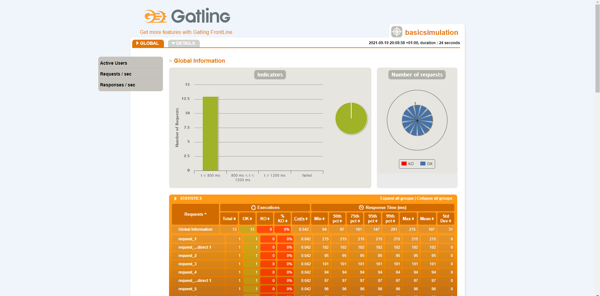
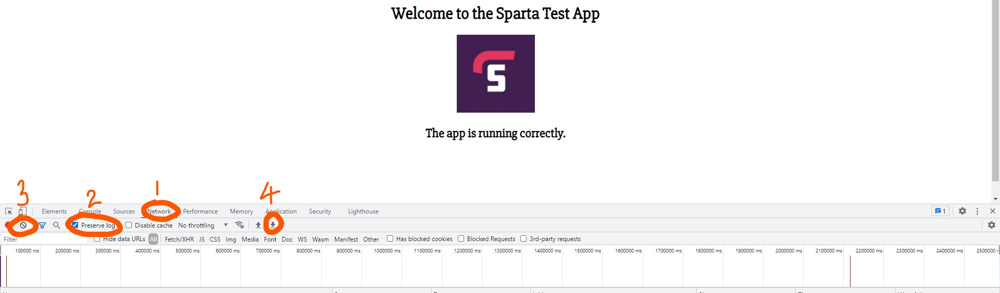
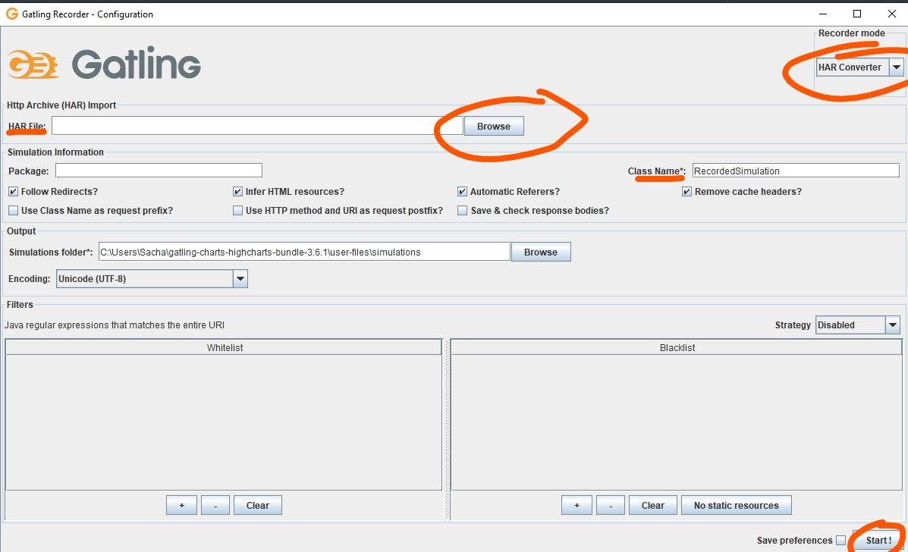

- [Set Up](#set-up)
  - [Prerequisites](#prerequisites)
  - [Installing Gatling](#installing-gatling)
  - [Verify Installation](#verify-installation)
  - [Verify Installation - Gatlin Runner](#verify-installation---gatlin-runner)
  - [Verify Installation - Gatlin Recorder](#verify-installation---gatlin-recorder)
- [Launching App from Autoscaling Group with your Database](#launching-app-from-autoscaling-group-with-your-database)
- [Record visit to each page on the app](#record-visit-to-each-pageon-the-app)
- [Run a test](#run-a-test)
- [Run your tests with 10 x more visits each time](#run-your-tests-with-10-x-more-visits-each-time)
## Set Up
### Prerequisites
- IntelliJ 
- Java 8+
- Scala plugin in IntelliJ (In Intellij 'Ctrl + Alt + S' to go into Plugin window and install Scala)

### Installing Gatling
https://www.blazemeter.com/blog/how-to-install-gatling-on-windows

- Download Gatling via https://gatling.io/open-source/ by pressing `Download Now`
- Either unzip the folder within your file explorer or use the command
`unzip gatling-charts-highcharts-bundle-2.3.0-bundle.zip`
- In Windows, `Edit the system environment variables` -> `Advanced` -> `Environment Variables...`
- Under System variables, click `New...`
  - Variable Name: GATLING_HOME
  - Variable value: the directory of the unzipped folder (e.g. C:\Users\YourName\gatling-charts-highcharts-bundle-3.6.1)
- Under User variables for Sacha, click `Path` -> `Edit...`
  - Add the path of the bin directory of your gatling folder (e.g.C:\Users\YourName\gatling-charts-highcharts-bundle-3.6.1\bin)

### Verify Installation
https://www.blazemeter.com/blog/gatling-installation-verification-and-configuration-the-ultimate-guide

To check if Gatlin is working properly, run the Gatling tests runner or the Gatling recorder:
- Go to the bin directory inside your gatling folder (where you unzipped your installation)

`cd gatling-charts-highcharts-bundle-3.6.1/bin`

### Verify Installation - Gatlin Runner

- Run the following command

`./gatling.bat`

- Should say GATLING_HOME is set to... and then ask you to enter a number between 0 and 5
- Enter 0 -> Enter nothing
- Should say:
'Reports generated in 0s.
Please open the following file: (path to an index.html file)'
- Put this link into your browser to see the results of the test

  

- Now you have verified that Gatling is working properly

### Verify Installation - Gatlin Recorder

- Run the following command

`./recorder.bat`

- Should say GATLING_HOME is set to... and open a window 'Gatling Recorder - Configuration':


- Now you have verified that Gatling is working properly

## Launching App from Autoscaling Group with your Database

- In the security group for your db, change the app ip to the app instance you launched with your autoscaling group

- SSH into your app instance
```
cd app
export DB_HOST=<DB_IP>:27017/posts
node seeds/seed.js
npm start
```

## Record visit to each page on the app
- Go onto the page for your app
- Right click anywhere on the page and click `Inspect`
- Click on `Network` (1 in diagram)
- Tick `Preserve log` (2 in diagram)
- Click on the no/prohibition sign (clear) to clear the history (3 in diagram)
- Now, go onto the posts page (by adding /posts to the end of your app ip)



- Click on the down arrow to export the HAR file
- Save it in your C folder and give it an appropriate name (e.g. sacha_app_posts_recorder.har)

## Run a test
- In the bin folder in your Gatling folder, run `recorder.bat`
```
cd bin
cd recorder.bat
```
- This will open a window 'Gatling Recorder - Configuration'
- Change Recorder Mode to `HAR Converter`
- Import the HAR file you saved (click `Browse`)
- Enter a Class Name: e.g. AppPostsTest
- CLick `Start`


- In the terminal, run `gatling.bat` to run the test
- Enter the number of the test you want to run (e.g. AppPostsTest)
- Select run description: Create a name for this test (e.g. Sacha App Posts Test 1 User)
- It will show the test info and say 'Please open the following file'
- Copy this file into your browser and you can see the results in a lovely user friendly format

## Run your tests with 10 x more visits each time
- In your gatling file directory:
  - `user-files` -> `simulations` -> Open your test file (e.g. AppPostsTest)
- In AppPostsTest, go to the end of the script to:

`setUp(scn.inject(atOnceUsers(1))).protocols(httpProtocol)`

- Increase the atOnceUsers value by a factor of 10, e.g.

`setUp(scn.inject(atOnceUsers(10))).protocols(httpProtocol)`

- Run `gatling.bat` again
- Select the same test as before
- Select run description: Create a different name for this test (e.g. Sacha App Posts Test 10 User)
- It will show the test info and say 'Please open the following file'
- Copy this file into your browser and you can see the results in a lovely user friendly format

- Repeat these steps, increasing the atOnceUsers value by a factor of 10 each time to see how the results change.