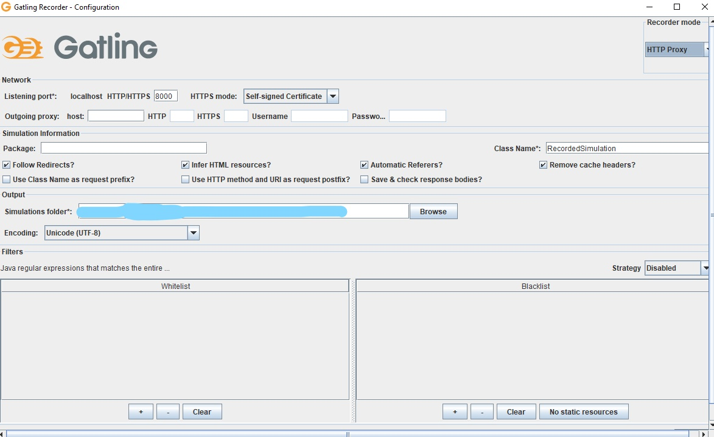

- [Set Up](#set-up)
  - [Prerequisites](#prerequisites)
  - [Installing Gatling](#installing-gatling)
  - [Verify Installation](#verify-installation)
  - [Verify Installation - Gatlin Runner](#verify-installation---gatlin-runner)
  - [Verify Installation - Gatlin Recorder](#verify-installation---gatlin-recorder)
## Set Up
### Prerequisites
- Java 8+
- Scala?

### Installing Gatling
https://www.blazemeter.com/blog/how-to-install-gatling-on-windows

- Download Gatling via https://gatling.io/open-source/ by pressing `Download Now`
- Either unzip the folder within your file explorer or use the command
`unzip gatling-charts-highcharts-bundle-2.3.0-bundle.zip`
- In Windows, `Edit the system environment variables` -> `Advanced` -> `Environment Variables...`
- Under System variables, click `New...`
  - Variable Name: GATLING_HOME
  - Variable value: the directory of the unzipped folder (e.g. C:\Users\YourName\gatling-charts-highcharts-bundle-3.6.1)
- Under User variables for Sacha, click `Path` -> `Edit...`
  - Add the path of the bin directory of your gatling folder (e.g.C:\Users\YourName\gatling-charts-highcharts-bundle-3.6.1\bin)

### Verify Installation
https://www.blazemeter.com/blog/gatling-installation-verification-and-configuration-the-ultimate-guide

To check if Gatlin is working properly, run the Gatling tests runner or the Gatling recorder:
- Go to the bin directory inside your gatling folder (where you unzipped your installation)

`cd gatling-charts-highcharts-bundle-3.6.1/bin`

### Verify Installation - Gatlin Runner

- Run the following command

`./gatling.bat`

- Should say GATLING_HOME is set to... and then ask you to enter a number between 0 and 5
- Enter 0 -> Enter nothing
- Should say:
'Reports generated in 0s.
Please open the following file: (path to an index.html file)'
- Put this link into your browser to see the results of the test
- Now you have verified that Gatling is working properly

### Verify Installation - Gatlin Recorder

- Run the following command

`./recorder.bat`

- Should say GATLING_HOME is set to... and open a window 'Gatling Recorder - Configuration':

- Now you have verified that Gatling is working properly